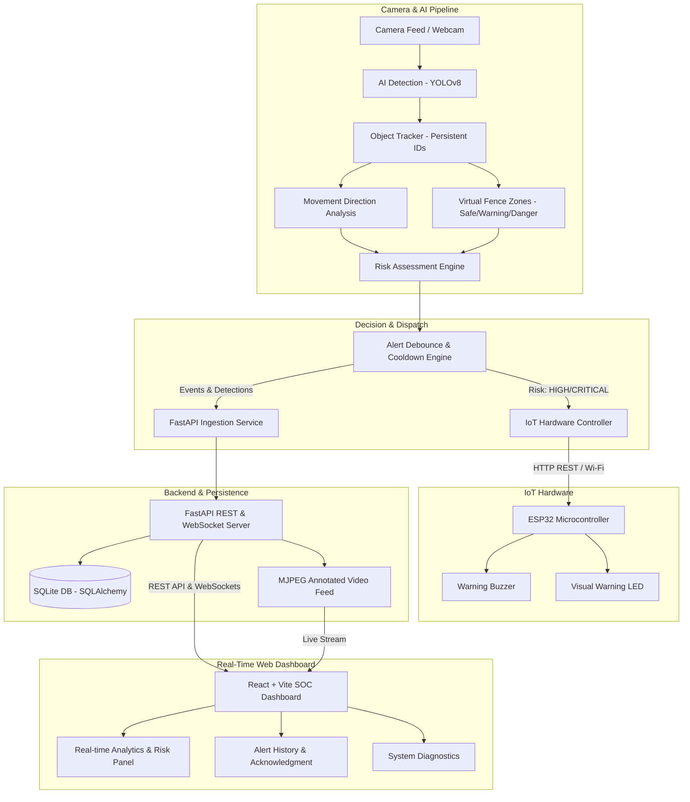

# SMART FENCE: AI & IoT-Based Intelligent Safety Monitoring System

[](https://fastapi.tiangolo.com)
[](https://ultralytics.com)
[](https://react.dev)
[](https://espressif.com)
[](https://opensource.org/licenses/MIT)

---

## 1. Project Title
**Smart Fence: AI & IoT-Based Intelligent Safety Monitoring System**  
An end-to-end computer vision and Internet of Things perimeter defense platform designed for perimeter security, railway boundaries, agricultural farmland protection, and industrial safety zones.

---

## 2. Problem Statement
Traditional perimeter security systems rely heavily on passive physical barriers or rudimentary motion sensors (PIR / IR tripwires). These legacy systems suffer from:
1. **Blind Alarm Triggering**: Inability to differentiate between harmless environmental motion (tree branches, wind, small birds) and genuine intrusions.
2. **Lack of Category Awareness**: No distinction between human intruders requiring law enforcement alerting and stray livestock or wildlife requiring non-lethal deterrents.
3. **No Directional or Intent Awareness**: A person walking parallel to or away from a fence triggers identical alarms as an intruder actively charging towards the boundary.
4. **Safety Hazards with High-Voltage Barriers**: Real electric fences can cause severe injury or fatal electrocution without pre-emptive early warning.

---

## 3. Motivation
Agricultural farmlands regularly suffer crop damage from wild elephants, cattle, and boars, often prompting farmers to erect unmonitored electric fences that inadvertently claim human and animal lives. In railway corridors and high-security industrial installations, unauthorized trespassing remains a critical hazard.

Smart Fence addresses this by introducing a **risk-aware, multi-factor early warning system**:
$$\text{Intelligence} = \text{Detection} + \text{Tracking} + \text{Direction Analysis} + \text{Virtual Zones} + \text{Dynamic Risk}$$

---

## 4. Objectives
* Accurately detect and classify humans and animals in real time.
* Maintain persistent identity tracking across video frames without ID switching.
* Calculate trajectory and movement vectors relative to the virtual fence line (`TOWARDS_FENCE`, `AWAY_FROM_FENCE`, `STATIONARY`).
* Partition the surveillance FOV into configurable geometric zones (`SAFE`, `WARNING`, `DANGER`).
* Formulate structured multi-tier risk decisions (`LOW`, `MEDIUM`, `HIGH`, `CRITICAL`).
* Debounce alerts to eliminate repetitive alert storms (`ALERT_COOLDOWN_SECONDS`).
* Dispatch warning commands over Wi-Fi to an ESP32 hardware actuator (Buzzer + LED).
* Deliver a real-time Security Operations Center (SOC) dashboard with live annotated video, statistics, charts, and system health telemetry.

---

## 5. Features
- **Real-Time YOLOv8 Vision**: High-speed inference using `yolov8n.pt` for person and animal classes.
- **ByteTrack Integration**: Persistent trajectory tracking with ground-contact anchor coordinates.
- **Directional Vector Engine**: Analyzes displacement slopes over sliding time windows.
- **Configurable Virtual Perimeter Zones**: Polygonal spatial checking using point-in-polygon math.
- **Multi-Factor Risk Assessment Engine**: Differentiates between human approach, animal intrusion, stationary presence, and sustained danger zone dwelling.
- **IoT Warning System**: ESP32 microcontroller driving acoustic frequency alarms (Buzzer) and visual strobe (LED).
- **Built-in Virtual Hardware Simulator**: Complete software simulation of ESP32 when physical hardware is not attached.
- **Full-Stack SOC Dashboard**: Dark-themed React + Vite interface with live video stream, dynamic threat banner, SQL-backed statistics, and filterable audit logs.

---

## 6. System Architecture



---

## 7. Technology Stack
* **AI & Computer Vision**: Python 3.11, OpenCV 4.8+, YOLOv8 (Ultralytics), PyTorch, ByteTrack, NumPy.
* **Backend API**: FastAPI, Uvicorn, SQLAlchemy ORM, Pydantic v2, WebSockets.
* **Database**: SQLite 3 with index-optimized tables.
* **IoT Hardware**: ESP32 DevKit V1, Arduino C++, HTTP REST WebServer, PWM Tone Generator.
* **Frontend**: React 18, Vite 5, Lucide Icons, Modern CSS3 with SOC Theme.
* **Testing**: Pytest automated test runner.

---

## 8. Hardware Requirements
For Physical Prototype Deployment:
1. **Host PC / Laptop**: Intel Core i5 / AMD Ryzen 5, 8 GB RAM, USB Webcam.
2. **ESP32 DevKit V1**: 2.4 GHz Wi-Fi enabled microcontroller.
3. **Piezoelectric Buzzer**: 5V active or passive buzzer (connected to GPIO 25).
4. **Warning LEDs**: High-brightness Red LED (GPIO 26) and Green LED (GPIO 27).
5. **Current Limiting Resistors**: 220 $\Omega$ and 330 $\Omega$.
6. **Breadboard & Jumper Wires**: Male-to-male and male-to-female cables.

> [!CAUTION]
> **Important Safety Requirement**: This project is a safety-monitoring prototype. Never directly connect the microcontroller to a real high-voltage electric fence energizer. The buzzer and LED represent the non-lethal warning mechanism.

---

## 9. Software Requirements
* Windows 10/11, Linux, or macOS
* Python 3.10 or 3.11
* Node.js v18+ and npm
* Arduino IDE (with ESP32 board package) for flashing ESP32

---

## 10. Installation

### 1. Clone & Set Up Python Environment
```bash
git clone https://github.com/your-username/smart-fence.git
cd "Smart Fence"

# Create and activate virtual environment (optional but recommended)
python -m venv venv
venv\Scripts\activate   # On Windows
# source venv/bin/activate # On Linux/macOS

# Install dependencies
python -m pip install -r requirements.txt
```

### 2. Configure Environment Variables
Copy `.env.example` to `.env`:
```bash
copy .env.example .env
```

### 3. Install Frontend Dependencies
```bash
cd frontend
npm.cmd install
cd ..
```

---

## 11. Running Instructions

### Step 1: Start the Backend & AI Engine
```bash
python -m uvicorn backend.main:app --host 127.0.0.1 --port 8000 --reload
```
* **Swagger API Documentation**: [http://127.0.0.1:8000/docs](http://127.0.0.1:8000/docs)
* **Direct Video Stream Feed**: [http://127.0.0.1:8000/api/video/feed](http://127.0.0.1:8000/api/video/feed)

### Step 2: Start the React Dashboard
In a separate terminal window:
```bash
cd frontend
npm.cmd run dev
```
Open your browser to: [http://localhost:5173](http://localhost:5173)

### Step 3: Flash ESP32 Firmware (Optional Hardware Step)
1. Open `esp32/smart_fence.ino` in the Arduino IDE.
2. Enter your Wi-Fi SSID and Password.
3. Select board: `ESP32 Dev Module` and flash to your device.
4. Note the IP assigned in the Arduino Serial Monitor and set `ESP32_IP` in `.env`.
*(If physical ESP32 is not connected, the system automatically uses its built-in Virtual Hardware Simulator).*

---

## 12. Risk Assessment Logic

The multi-factor risk engine evaluates targets according to this matrix:

| Object Type | Zone | Movement Vector | Persistence | Evaluated Risk | Actuator Output |
| :--- | :--- | :--- | :--- | :--- | :--- |
| Any | Safe | Any | Any | **LOW** | Buzzer: OFF, LED: OFF |
| Human / Animal | Warning | Away from Fence | Any | **LOW** | Buzzer: OFF, LED: OFF |
| Animal | Warning | Towards Fence | Any | **MEDIUM** | Buzzer: OFF, LED: ON |
| Human | Warning | Towards Fence | Any | **HIGH** | Buzzer: ON, LED: ON |
| Animal | Danger | Stationary | < 3s | **HIGH** | Buzzer: ON, LED: ON |
| Human | Danger | Any | < 3s | **HIGH** | Buzzer: ON, LED: ON |
| Human / Animal | Danger | Towards Fence | Any | **CRITICAL** | Buzzer: Rapid Siren, LED: Strobe |
| Human / Animal | Danger | Any | $\ge$ 3s Dwell | **CRITICAL** | Buzzer: Rapid Siren, LED: Strobe |

---

## 13. API Documentation Summary

| Method | Endpoint | Description |
| :--- | :--- | :--- |
| `POST` | `/api/detections` | Ingests a new object detection record |
| `GET` | `/api/detections` | Paginated query of detection records |
| `GET` | `/api/detections/recent` | Retrieves recent 20 detections |
| `POST` | `/api/alerts` | Creates a new security alert and triggers IoT |
| `GET` | `/api/alerts` | Lists alerts with filtering |
| `PUT` | `/api/alerts/{id}/ack` | Acknowledges an active alert |
| `GET` | `/api/dashboard/stats` | Real-time statistics computed from DB |
| `GET` | `/api/dashboard/analytics` | Hourly detection and risk series for charts |
| `GET` | `/api/system/status` | Diagnostics of Camera, AI, Backend, DB, ESP32 |
| `POST`| `/api/system/iot/trigger-test` | Operator diagnostic test for IoT buzzer/LED |
| `GET` | `/api/video/feed` | MJPEG video stream with live annotations |
| `WS`  | `/ws/live` | Bidirectional WebSocket for real-time telemetry |

---

## 14. Automated Test Suite

Run the 15 automated test cases:
```bash
python -m pytest tests/test_smart_fence.py -v
```
All 15 scenarios verify:
1. Human in safe zone $\rightarrow$ LOW risk
2. Human in warning zone advancing $\rightarrow$ HIGH risk
3. Human in danger zone advancing $\rightarrow$ CRITICAL risk
4. Direction vector computation $\rightarrow$ TOWARDS_FENCE
5. Direction vector computation $\rightarrow$ AWAY_FROM_FENCE
6. Animal in warning zone $\rightarrow$ MEDIUM risk
7. Animal in danger zone $\rightarrow$ HIGH risk
8. Stationary target filtering
9. Multi-target track isolation
10. Low-confidence rejection
11. Debounce cooldown verification
12. Camera failure fallback
13. ESP32 disconnection resilience
14. Backend unavailability handling
15. Cooldown expiration and re-triggering

---

## 15. Limitations & Future Enhancements

### Limitations
- **Single Monocular Camera**: Coordinates are measured in 2D image pixel space rather than calibrated metric depth.
- **Lighting Conditions**: Standard RGB cameras suffer in zero-light nighttime environments unless supplemented by infrared (IR) illuminators or thermal cameras.

### Future Enhancements
- **Stereo Vision / LiDAR**: Calibrated metric depth measurement for absolute physical distance in meters.
- **Thermal Imaging Support**: Integration with FLIR thermal sensors for night vision perimeter surveillance.
- **PTZ Camera Auto-Tracking**: Directing motorized pan-tilt-zoom cameras to zoom into high-risk targets.
- **Edge Deployment on Jetson Nano**: Running TensorRT-accelerated YOLO models directly on edge hardware.
